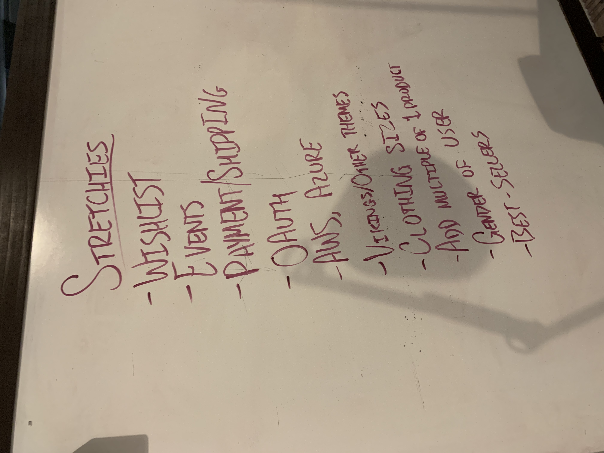
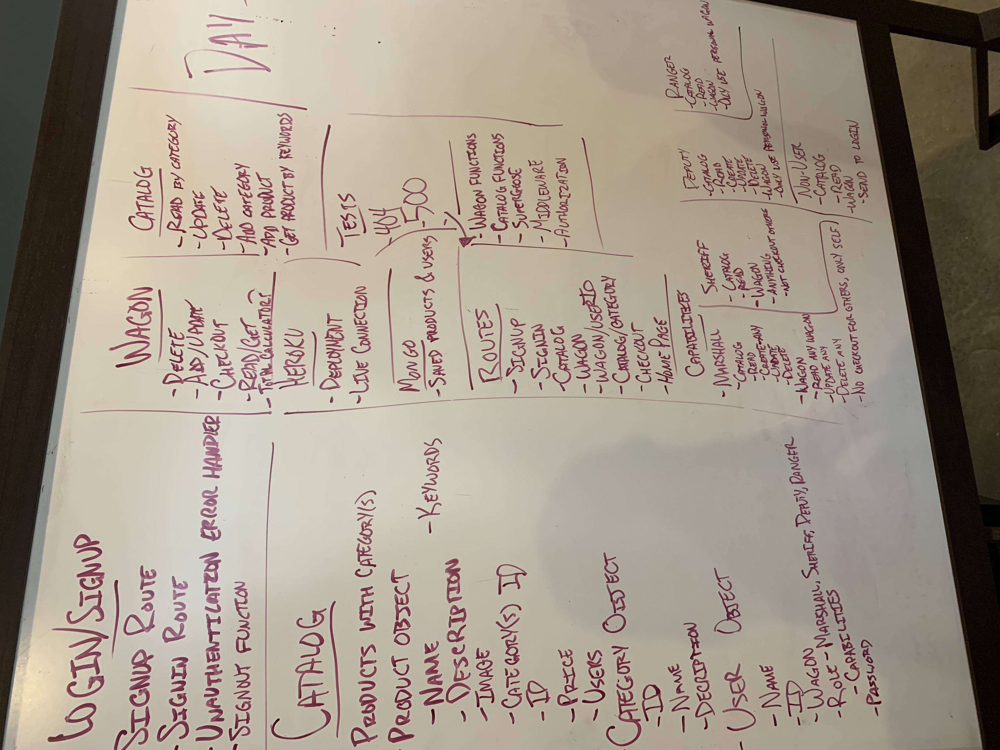
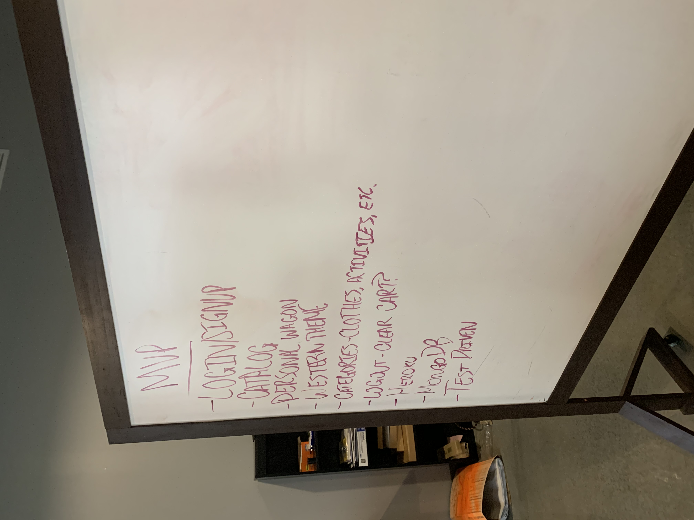

# Wild West Warehouse

#### The best place to shop for all your cowboy needs.

The Wild West can be a dangerous place. On this site, you'll find everything you need to survive out there with all the outlaws and rattlers you may run across. Feel free to add anything to your wagon and look around at all the interesting things our shop has for y'all.

[WWW Back End Deployment](https://wwwshop.herokuapp.com)

[WWW Back End Repository](https://github.com/WWWStore/WWW)

###### Made by Andy Fiedler, Steven Jones, Ian Smith, Jon Struve

#### Documentation
* [Click here to try it out!](https://wwwshop.herokuapp.com/api-docs)

#### Tests
* How did we run tests?
  * A lot our tests were made through Supergoose, an extension we use to test out routes with fake requests to mimic real deployment.
  * Other tests include database testing to make sure that something is properly saved to the database after the product or user has been created.

#### Planning Process

### Plans for the Future

`Preferably we get at least one of these done a week.`
[x] Connecting products to a category to filter by categories.
[ ] Not having duplicate products in the cart.
[ ] Payment - through Stripe or Paypal? - implementation.
[ ] Shipping implementation.
[ ] Best Sellers for our home page.
[x] Recently viewed items to keep track of what they are interested in.
[ ] User gender specifications.
[ ] Other themes?
